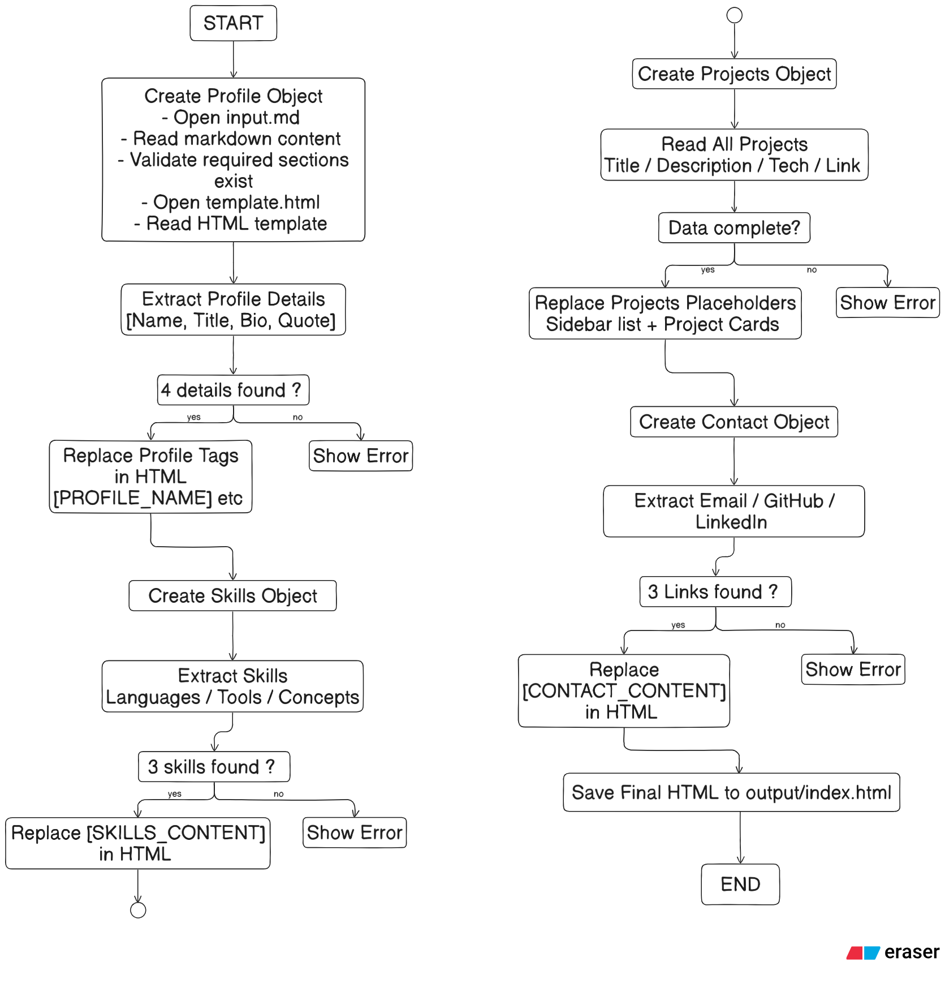
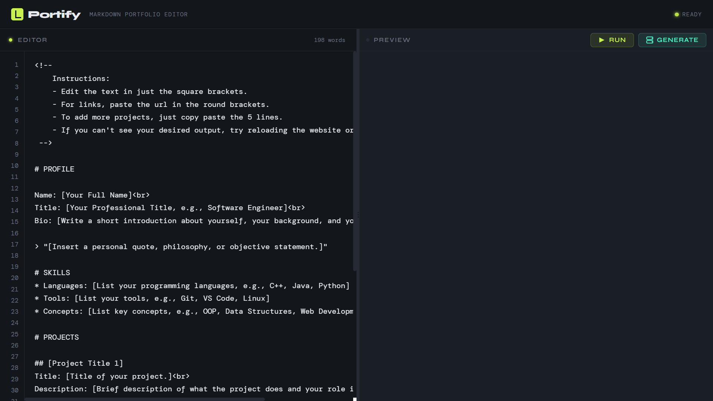
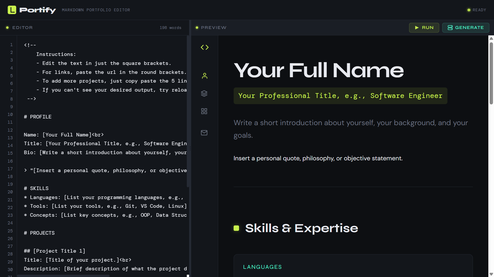
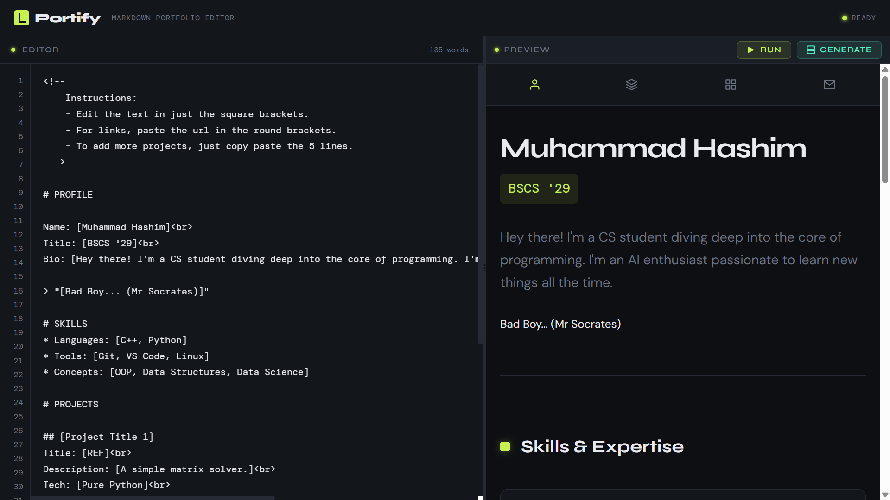
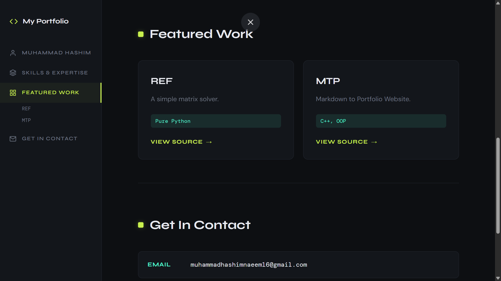

# Portify - A Markdown-to-Portfolio Generator Engine

Portify is an automated pipeline that converts structured Markdown into a fully responsive portfolio website. It allows developers to maintain and update their portfolios without writing frontend code, effectively bridging high-level UI design with low-level system programming.

## Program Flow and Logic 

### frontend.html

This is the user-facing interface. It provides a dual-pane layout of adjustible size:

* Left pane: Markdown editor
* Right pane: Live preview (iframe)

Users write Markdown in the editor and use these two buttons:

* Run: Updates preview inside the iframe
* Generate: Opens the final portfolio in a new browser tab.

### server.py

**1-** Acts as the bridge between the browser and the C++ engine

**2-** Receives Markdown input from the frontend

**3-** Stores it in input.md

**4-** Executes the compiled C++ engine

**5-** Returns the generated index.html

**6-** Displays it in the preview iframe    

### main.cpp (Engine):

This is the core processing unit of Portify.

* Built using Object-Oriented Programming in C++
* Uses hierarchical inheritance with Portfolio as the base class and Profile, Skills, Projects, and Contact as derived classes.

**Core Functionality:**

* Extract structured content from Markdown (input.md)
* Map it into predefined sections of the template (template.html) via string parsing 
* Identifies error if found while mapping.
* Generate a complete index.html file
* Given flowchart explains the working flow of engine:

## Features

**Dual-Pane Workspace**

IDE-style editor with real-time preview

**Adjustable Layout**

Draggable divider for flexible workspace

**State-Aware Controls**

   * Run → preview
   * Generate → full-page output
   
**Engine**

Supports structured sections:
   * Profile
   * Skills
   * Projects
   * Contact
   
**Error Handling System**

Detects invalid Markdown structure and engine failures, and notifies the user

## Tech Stack & Concepts

   * **Object-Oriented Programming (C++)**
        * Encapsulation (Profile, Skills, Projects classes)
        * Inheritance (Portfolio base class)
        * Dynamic Polymorphism (Late Binding)
   * **File Handling**
        * <fstream> for reading/writing files
   * **String Processing**
        * Custom parsing using std::string functions
   *  **Exception Handling**
        * Error signaling via exit codes from C++ engine to frontend
   * **Full-Stack Integration**
        * HTML/CSS/JS (Frontend)
        * Python Flask (Server)
        * C++ (Processing Engine)

## Instructions to run

**1-** Download the project files

**2-** Compile main.cpp

     cd./backend
     g++ main.cpp -o main.exe
     cd ..

**3-** Run python server.py

    python server.py  

**4-** Open in browser

    http://127.0.0.1:8000/

**5-** Use the application

* Write your Markdown in the editor

* Click Run to preview

 

* Click Generate to open the final portfolio in a new tab

## Authors

* **Batool Zafar**
* **Muhammad Hashim**

